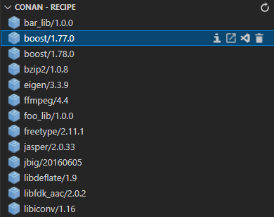
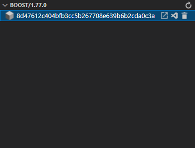
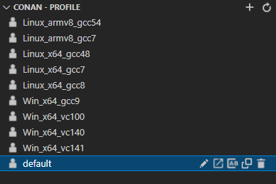
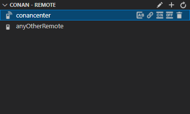

# VSConan - Conan Extension for Visual Studio Code

<!-- TODO: Replace the image source to with http link to github raw -->
<p align="center">

</p>

## Introduction 

**VSConan** extension makes it easy to manage the conan local cache on your machine. It provides you an easy way to access your local cache and manage it by using integrated explorer in the VS Code without typing a single line of command in the terminal. **VSConan** contains several features such as quick overview of installed packages, rename and duplicate profiles, enable and disable remote and more. For further information see [Extension Features](#extension-features).

## Prerequisites
* [Python](https://www.python.org/) and [conan](https://pypi.org/project/conan/) installed on your machine.

## How To Start
**VSConan** extension will be activated, if the folder you open contains `conanfile.py` or `conanfile.txt`, we call this conan workspace or if you open the explorer tab on the left side. Once the extension is activated, it will create a default configuration file (if it doesn't exist) under the `.vsconan` directory in your home folder. 
* Windows - `C:\Users\<user>\.vsconan\config.json`
* Linux - `/home/<user>/.vsconan/config.json`

The `config.json` will have the format as following:
``` json
{
    "general": {
        "python": "python"
    },
    "explorer": {
        "python": "python"
    }
}
```

You have to define the location of your python interpreter, where conan is also installed. If you have defined it using environment variable / alias, simply put it directly there as you can see in the example config file above. Otherwise you have to give the full path, where the python interpreter is located.

!!! NOTE !!! Currently only the explorer python from the configuration file is used.

## Extension Features
The **VSConan** extension contains two major groups of features, one of them is the [Conan Exploer](#conan-explorer), where you can use to manage your local cache, and the other one is [Conan Workspace](#conan-workspace), where you can save your configuration of different conan flow commands in your VSCode workspace.

### Conan Explorer

The **VSConan** extension contributes a Conan Explorer view to VS Code. The Conan Explorer lets you examine and manage important assets of your conan local cache: recipe, binary packages, profile and remote.

#### Conan Recipe

In the Conan Recipe explorer you can have an overview of the installed conan recipe in your local cache. 



As you can see in the picture above, there are several inline options on each item in the treeview.
* _Information_  
  Open a web view in VS Code editor, that contains information about this selected recipe. Currently the web view only shows a plain JSON text, that is obtained from the Conan CLI. 
* _Open in Explorer_  
  Open the the recipe path in the explorer
* _Open in VS Code_  
  Open the selected recipe in a new VS Code window
* _Remove_  
  Remove the selected recipe
#### Conan Binary Package

By selecting the recipe, the corresponded binary packages will be shown in this treeview.



Each item of this treeview has following options to offer:
* _Open in Explorer_  
  Open the selected binary package in the explorer
* _Open in VS Code_  
  Open the selected binary package in a new VS Code window
* _Remove_  
  Remove the selected binary package

#### Conan Profile

All the profiles that you saved on your machine will be listed in this explorer. By pressing `+` on top of the treeview, you can create a new empty profile.



As the other treeview, each item of this treeview contains several functionalities:
* _Edit_  
  Open the selected profile in the VS Code editor
* _Open in Explorer_  
  Open the selected profile in the file explorer
* _Rename_  
  Rename the selected profile
* _Duplicate_  
  If you want to change a small detail from a certain profile but you do not want to lose the original profile, we provide you this duplicate option to fulfill your purpose.
* _Remove_  
  Remove the selected profile

#### Conan Remote

Finally we come to the last part of this explorer, which is the explorer of the conan remote.  
This explorer provides you following options:
* _Edit_  
  Since the collection of remotes in conan is defined in one file called `remotes.json`, this option is not available of each remote item in the treeview. This will open `remotes.json` file in the VS Code editor instead.
* _Add_  
  Add a new remote



As other treeview, each item is equipped with several options, that you can use to maintain your remotes.
* _Rename Remote_  
  Rename the selected remote
* _Update URL_  
  Modify the URL in the selected remote
* _Enable Remote_  
  Enable the selected remote. Enabled remotes can be seen from the icon next to the remote name. The remote `conancenter` in the picture above is enabled. 
* _Disable Remote_  
  Disable the selected remote. Disabled remotes can be seen from the icon next to the remote name. The remote `anyOtherRemote` in the picture above is disabled. 
* _Remove Remote_  
  Remove the selected remote

### Conan Workspace

## Release Notes
Detailed Release Notes are available [here](CHANGELOG.md).

## Contributing

See [the contribution guidelines](CONTRIBUTING.md) for ideas and guidance on how to improve the extension.

### Code of Conduct
See [Code of Conduct](CODE_OF_CONDUCT.md).

## License

[MIT](LICENSE.md)
